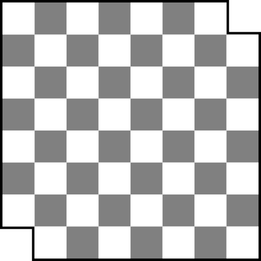

## Adventure Game and OOP

Topics:

- Method definition, parameters, return values
- Attributes
- Static vs instance methods and attributes (`Math.sqrt` vs `List.size()`)
- Where we can and can't access static methods and attributes
- `switch` statements, avoiding fallthrough
- State machines https://developer.mozilla.org/en-US/docs/Glossary/State_machine

Java Notes:

- https://www.w3schools.com/java/java_methods_param.asp
- https://www.w3schools.com/java/java_methods_return.asp
- https://www.w3schools.com/java/java_classes.asp
- https://www.w3schools.com/java/java_class_attributes.asp
- https://www.w3schools.com/java/java_class_methods.asp

_Note that these links make a contrast between static methods and public
methods; this contrast is misleading, as these concepts are orthogonal_.

## Computational Reasoning and Proofs

**Chessboard Tiling Puzzle:**



You have a chessboard (an `8x8` grid of checkered light and dark squares) which
is missing its two corner dark squares, leaving `62` squares remaining. Can you
tile this board with `2x1` tiles? Provide a tiling, or a proof that none exists.

_In this problem, "tiling" means covering the board with tiles so that each tile
covers two squares, each square is covered by a tile, and no tiles overlap or
hang off the edge of the board._

_Hint: use the fact that checkered pattern to your advantage._

**Solution:**

If you try to find a tiling for the board, you'll find that it seems impossible.
But how do we prove that?

Notice that the board starts with `62` square, of which `32` are light and `30`
are dark. When we place a `2x1` tile on the board, it will always cover one
light square and one dark square. With each tile we add, we therefore decrease
the number of uncovered light and dark squares by one each. Therefore, the
number of uncovered light squares will always be `2` more than the number of
uncovered dark squares.

Once we've placed `30` tiles on the board, we'll always have two uncovered light
squares remaining. Since those two light squares will never be adjacent, it will
always be impossible to cover the last two squares with a single tile.
Therefore, it is impossible to completely tile the board.

## Bar Chart Coding Interview Practice

Print a bar chart based on the numbers in the list `numbers` where each number
`n` in the list gets its own column with `n` `X` characters in it.

For the numbers (1, 4, 2, 7, 3) the output should be:

```
   X
   X
   X
 X X
 X XX
 XXXX
XXXXX
```

## Sorting and Algorithms

- What is an algorithm https://en.wikipedia.org/wiki/Algorithm

  The abstract approach that we use to solve a problem.

- Sorting algorithms https://en.wikipedia.org/wiki/Sorting_algorithm#Stability

- In-place algorithms https://en.wikipedia.org/wiki/In-place_algorithm

- Invariants and correctness
  https://en.wikipedia.org/wiki/Invariant_(mathematics)#Invariants_in_computer_science

  How do we know that an algorithm is correct? How do we know that an algorithm
  terminates?

Playing cards sorting demo.

## Mutability

Methods can mutate their inputs, or they can leave their input unchanged and
return a new structure. Compare the following two implementations of a `triple`
function.

```java
void triple(List<Integer> numbers) {
  for (int i = 0; i < numbers.size(); i++) {
    int n = numbers.get(i);
    numbers.set(i, n * 3);
  }
}
```

```java
List<Integer> triple(List<Integer> numbers) {
  List<Integer> result = new ArrayList<>();

  for (int i = 0; i < numbers.size(); i++) {
    int n = numbers.get(i);
    result.add(i, n * 3);
  }

  return result;
}
```

## Arrays vs Immutable Lists vs Mutable Lists

| Arrays                    | Immutable Lists           | Mutable Lists             |
| ------------------------- | ------------------------- | ------------------------- |
| ❤️ Nice syntax            | ❤️ Ok syntax              | 💩 Annoying syntax        |
| 💩 Fixed length           | 💩 Fixed length           | ❤️ Flexible length        |
| 💩 Can update elements    | 💩 Can't update elements  | ❤️ Can update elements    |
| ❤️ `[]` syntax            | 💩 No `[]` syntax         | 💩 No `[]` syntax         |
| 💩 Printing is annoying   | ❤️ Printing is reasonable | ❤️ Printing is reasonable |
| 💩 No nice helper methods | ❤️ Nice helper methods    | ❤️ Nice helper methods    |
| ❤️ Can store primitives   | 💩 No primitives          | 💩 No primitives          |

## Lists

- Creation:

  ```java
  List<String> dirs = List.of("north", "south", "east", "west");
  ```

- Printing:

  ```java
  List<String> dirs = List.of("north", "south", "east", "west");

  System.out.println(dirs); // Prints [north, south, east, west]
  ```

- API:

  ```java
  List<String> dirs = List.of("north", "south", "east", "west");

  dirs.size()                           // 4
  dirs.get(0)                           // "north" (can't use [0])
  dirs.get(dirs.size() - 1)             // "west"
  dirs.get(random.nextInt(dirs.size())) // Random direction
  ```

- Immutability: `List.of` makes an immutable list that we can't update or add
  to.

  ```java
  List<String> dirs = List.of("north", "south", "east");

  dirs.set(0, "up"); // `UnsupportedOperationException`
  ```

- Making a mutable list:

  ```java
  List<String> dirs = List.of("north", "south", "east");

  // Make a mutable list from an existing list
  List<String> mutableDirs = new ArrayList<>(dirs);

  // Make a mutable list from scratch
  List<String> mutableDirs = new ArrayList<>(List.of("north", "south", "east"));
  ```

- Mutable API:

  ```java
  List<String> mutableDirs = new ArrayList<>(List.of("north", "south", "east"));

  mutableDirs.set(0, "up"); // mutableDirs = [up, south, east, west]
  mutableDirs.add("down");  // mutableDirs = [up, south, east, west, down]
  ```

  See also:

  - `addAll`
  - `contains`
  - `equals`
  - `getLast`
  - `indexOf`
  - `isEmpty`
  - `lastIndexOf`
  - `removeLast`
  - `reversed`
  - `sort`
  - `subList`

- No Primitives:

  ```java
  List<char> letters = List.of('a', 'b', 'c'); // Doesn't work
  ```

  We can't declare a list of primitives, we have to use wrapper classes:

  - `int` -> `Integer`
  - `double` -> `Double`
  - `boolean` -> `Boolean`
  - `char` -> `Character`

  ```java
  List<Character> letters = List.of('a', 'b', 'c');
  ```

https://runestone.academy/ns/books/published/csawesome/Unit7-ArrayList/topic-7-1-arraylist-basics.html

https://runestone.academy/ns/books/published/csawesome/Unit7-ArrayList/topic-7-2-arraylist-methods.html

## Arrays

- Creation:

  ```java
  String[] dirs = { "north", "south", "east", "west" };
  ```

- Printing:

  ```java
  System.out.println(dirs); // Prints nonsense
  System.out.println(Arrays.toString(dirs)); // Prints { "north", "south", "east", "west" }
  ```

- API:

  ```java
  dirs.length                       // 4
  dirs[0]                           // "north"
  dirs[dirs.length - 1]             // "west"
  dirs[random.nextInt(dirs.length)] // Random direction
  dirs[0] = "up";                   // dirs = { "up", "south", "east", "west" }
  ```

- Fixed size: Arrays have a fixed length. No equivalent of Python's `append`.

https://runestone.academy/ns/books/published/csawesome/Unit6-Arrays/topic-6-1-array-basics.html

https://runestone.academy/ns/books/published/csawesome/Unit6-Arrays/topic-6-2-traversing-arrays.html

https://runestone.academy/ns/books/published/csawesome/Unit6-Arrays/topic-6-3-arrays-with-foreach.html

## Java Syntax

See my (evolving) Java cheatsheet:
[materials/cheatsheet/cheatsheet.java](materials/cheatsheet/cheatsheet.java).
