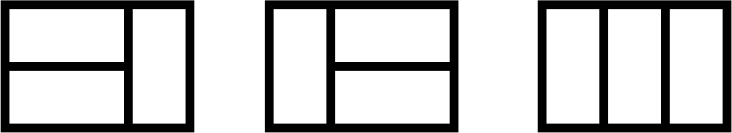

## Induction Tiling Puzzle

There are `3` distinct ways to tile a `2x3` board with `2x1` tiles.

How many distinct ways are there to tile `2x10` board with `2x1` tiles? Find a
proof for the correctness of your answer.

_Hint: consider at the Fibonacci sequence_
